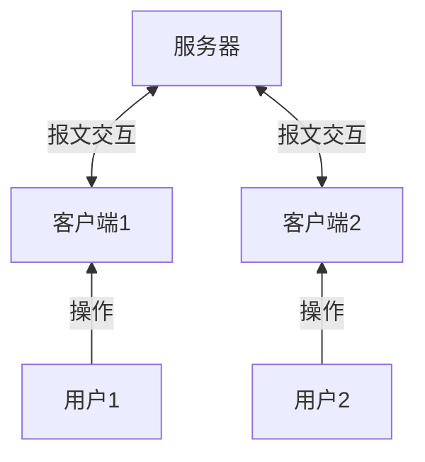
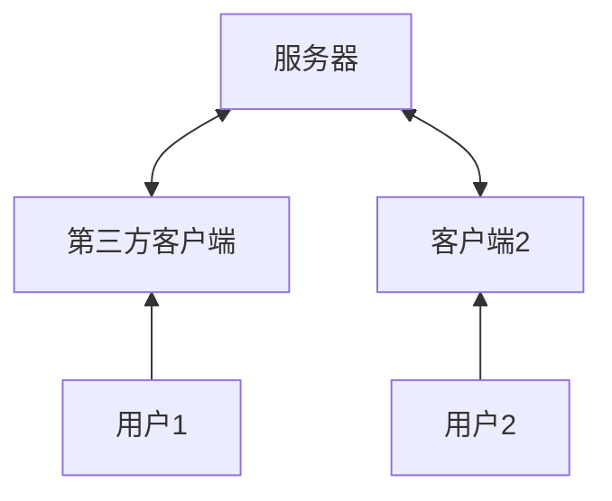
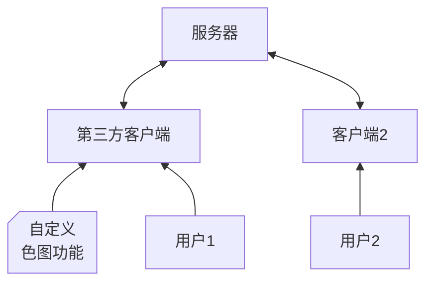

> 隔着网线，没人知道[你是一只猫娘](https://zh.moegirl.org.cn/zh-hans/%E8%B5%9B%E5%8D%9Aoo#.E8.B5.9B.E5.8D.9A.E7.8C.AB.E5.A8.98.2F.E8.B5.9B.E5.8D.9A.E6.B4.97.E8.84.91.E5.92.92)

本文目的是对 QQ 机器人的一些基本概念进行介绍。

<!-- more -->

## 第三方客户端

QQ 平时是这样工作的：用户操作客户端，客户端与服务器进行网络报文交互，最终通过服务器与其他用户进行交流沟通

古时候有个段子叫 “隔着网络没人知道你是条狗”；同样地，隔着网线，服务器也很难判断这个发过来的数据包到底是客户端真实发出的，还是经过人为精心构造的（先暂时不谈腾讯的各种反制措施）。我们完全可以编写一段程序，假装成正版 QQ 客户端，与腾讯的服务器进行报文交互，我们把这段程序称为 `第三方客户端` 。早期很多 QQ 机器人都是基于这种方式实现的，比如大名鼎鼎的 [mirai](https://github.com/mamoe/mirai) .

具体怎么做的，原理大体就是通过逆向工程获得客户端与服务器之间交互方式，比如用的什么协议，打的哪个端口。这操作多少有点灰色，而且我也只是略知大概，并不十分懂细节，所以只讲得了这些。

## 添加我们需要的功能

当然了，仅仅停留在复刻一个 QQ 客户端没啥太大的意义，我们想要的是一个~~猫娘~~机器人。幸运的是，由于这个第三方客户端是我们自己编写的，我们可以自由地为其添加一些我们自定义的功能，比如对外暴露各种接口，比如向我们需要的地址发送我们想要的信息；或者干脆写一个~~大家都喜欢的~~功能：当群里有人发出指令 `/色图` 时，机器人就向这个群发一张色图：

> ~~骗你的，其实一点也不色，而且油腻仙贝也并不是猫娘~~

总之，现在的 QQ 是这样的：

其实这样就算一个最简单的机器人了。

彼时 QQ 机器人繁荣发展，各种大大小小的框架、优秀实例层出不穷，开源社区也得到极大发展。比如上面提到的 mirai，还有 [go-cqhttp](https://github.com/Mrs4s/go-cqhttp) —— 这个项目的灵感来源 [coolq-http-api](https://github.com/kyubotics/coolq-http-api) 甚至还催生出了一套用于机器人框架与机器人应用之间通信使用的协议标准 [onebot](https://github.com/botuniverse/onebot) ，至今仍在持续发展。

基于这些一级框架，还衍生出了更多二级框架、优秀实现，比如与 mirai 一样大名鼎鼎的 [nonebot](https://github.com/nonebot/nonebot), [nonebot2](https://github.com/nonebot/nonebot2)，以及基于后者开发的 [zhenxun_bot](https://github.com/HibiKier/zhenxun_bot) ; 比如项目极庞大，完成度极高，社区内容极丰富的 [koishi](https://github.com/koishijs/koishi); 还有没那么大名鼎鼎，但是同样优秀，在工程实践上毫不逊色的 [Graia Project](https://github.com/GraiaProject) 等。行文至此，真是不禁叫人感慨：那种[勃勃生机，万物竞发](https://zh.moegirl.org.cn/zh-hans/%E4%BC%98%E5%8A%BF%E5%9C%A8%E6%88%91)的境界，犹在眼前。

## 腾讯的反击

OK 了，我们上面引入第三方客户端概念的时候有意暂时略过了腾讯的各种反制措施。但是现实中，腾讯肯定不会这么爽快地同意我们自己手搓的客户端与服务器进行交互的，不管是从商业利益层面，还是从安全风险规避层面，或者其他层面考量。

有效的反制措包括频繁修改客户端与服务器之间的通信协议，让民间开发者无法及时破解；或者要求数据包进行签名，第三方客户端无法完成签名，也无法与服务器交互。盛极一时的 mirai 、go-cqhttp 就在腾讯的步步紧逼下频繁遭遇无法登录等问题，渐渐落寞。
（刚去看了下，发现 mirai 论坛其实还算活跃，看来这玩意生命力还挺顽强 [MiraiForum](https://mirai.mamoe.net/)）

> 还有一个我不愿意多谈的话题，那就是腾讯会动用法律手段制裁第三方 QQ 机器人 —— 如果第三方机器人盈利了的话，作为计算机界的口袋罪，非法侵入计算机系统的帽子极大概率是能被安上的。
[如何看待近期大量的第三方QQ机器人停止运营？](https://www.zhihu.com/question/411466505)

总之，那会开源 bot 社区可以说是愁云惨淡万里凝，go-cqhttp 的这个 issue 鲜明地体现了 23 年的社区穷途末路的悲观心态：[QQ Bot的未来以及迁移建议](https://github.com/Mrs4s/go-cqhttp/issues/2471) .

不过天无绝人之路，正如 issue 中预言的，`协议库的时代已经过去, 接下来是Hook官方客户端的时代了` . 在第三方 bot 最低谷的 2023 年，bot 未来的希望正在悄然破壳而出。

## QQ NT 的救赎

2023 年，基于 QQNT 架构的新版 QQ 客户端推出。新 QQ 客户端的技术架构比较特殊，分为两层：基于 electron 的上层 UI 层，以及用 C++ 实现的下层核心层。下图便是微信公众号 `腾讯云开发者` 发布的 [Electron以慢著称，为什么桌面QQ却选择它做架构升级？](https://mp.weixin.qq.com/s/OQA7sUqqC_2yYRPhmxnotA) 一文中贴出的 NT QQ 架构示意图。

> 好时代，来临力！

### 劫持原生客户端路线

electron 基于 web 前端技术的特性天然地有利于第三方开发。很快，24 年初，一个名为 [LiteLoaderQQNT](https://github.com/LiteLoaderQQNT/LiteLoaderQQNT) 的开源项目提交了它的第一个 commit. 这个项目的作用说起来很简单，就是提供了一套在 NT QQ 上开发插件的基础设施，包括插件加载框架，一些 API，一些 web 组件等。

基于 `LiteLoader`, [LLOneBot](https://github.com/LLOneBot/LLOneBot/tree/main) 项目出现了，成功地补齐了劫持客户端路线的最后一块拼图。 llob 可以劫持上层 UI 界面，实现调用底层的内核 API 。客户端启动后，llob 也会依据配置，同步启动 HTTP 服务或者 WS 服务，对外提供一系列接口，使得开发者可以最终自由操作 QQ 客户端。下图就是基于该项目实现 QQ 机器人的示意图。

BTW，llob 项目社区还发展出了 `NapCat` 项目，二者算是姊妹项目。区别在于 llob 需要启动客户端才能运行，而 NapCat 不需要，这使后者更适合无图形界面的 Linux 服务器等环境。不过呢，因为一些场外的因素，我不太喜欢这个项目。不过项目本身的质量还是不错的。

随着 llob 的出现，新路线使 QQ 机器人开发重新焕发了生机，活出了第二春。在早期第三方客户端时期就已经积累了一大批独立于客户端实现的 QQ 机器人应用层框架，现在可以以 OneBot 协议无缝对接 llob .

### 拉格朗日和他的小伙伴们

进入 QQ NT 时代，依然有手搓仙人坚持古法熬制框架，复刻了 NT 协议的第三方客户端实现。其中影响力最大的莫过于 [Lagrange.Core](https://github.com/LagrangeDev/Lagrange.Core) . 正如文档所说，这是一个基于纯 C# 的 NTQQ 协议实现，是一个与 mirai 性质相同的项目。

与之相关的还有 [OpenShamrock](https://github.com/whitechi73/OpenShamrock) 和 [Chronocat](https://github.com/chrononeko/chronocat), 这仨的开发者好像有那个什么 py 交易，互相把对方标为自己的 `相关项目` 。OpenShamrock 是个在手机上运行的基于 NTQQ 的框架，性质类似于手机版 llob . 至于 Chronocat ，这个就跟 llob 很相似了，区别在于这个用的不是 OneBot 协议，而是 [Satori](https://satori.js.org/zh-CN/introduction.html) 协议。

## 魔高一尺，道高一丈

很可惜，开源社区没有图恒宇，我们总是无法给予 QQ 机器人完整的一生。基于原生客户端实现机器人的路线固然规避了协议方面被围追堵截的状况；但是同时，腾讯也拥有了检测客户端状况是否异常的能力，隔着网线，腾讯终于发现了你其实是个猫娘。

从 24 年底、25年初开始，`LiteLoaderQQNT` 用户就频繁出现账号被风控的情况，尤其是安装了 llob 这种对客户端影响较大的插件时风险更大。llob 刚问世时动辄挂几个月不出问题的情况再也不是那么容易复现的了，现在大都在掰着手指头数着日子等风控。[探讨一下腾讯封号的机制](https://github.com/LLOneBot/LLOneBot/issues/534) . 

戏剧性的是，随着签名服务项目的传播，原先已经陷入低谷的第三方客户端路线反而同样焕发了第二春，而且目前似乎比基于 hook 原生客户端路线的项目还要稳定些。

## 最后

该说的都说得差不多了。其实还有个腾讯官方推出的机器人项目，论起来应该也讲一讲；但是我厌恶腾讯的上述种种做派，再加上我一个小小个人开发者确实没有资格开发官方机器人，我也不了解这玩意，也不知道该说些什么，我就把它归入不该说的行列中了。

最后，希望天再次不绝人之路，让第三方机器人这个产业能再次逢凶化吉，遇难呈祥，我这种普通开发者也能给 bot 一个完整的一生。