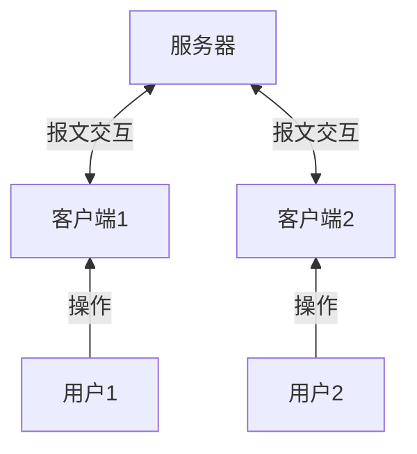
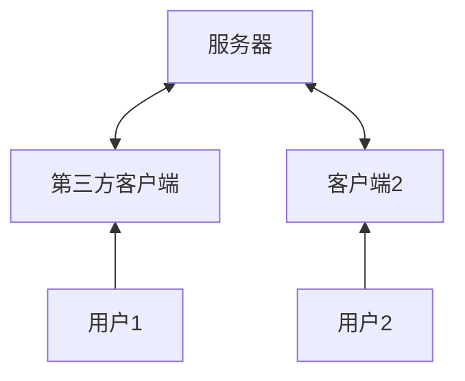
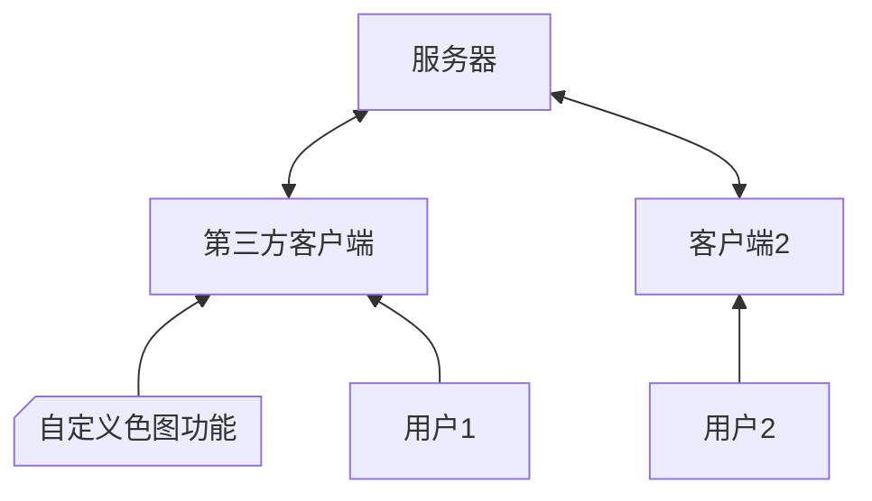

> 隔着网线，没人知道[你是一只猫娘](https://zh.moegirl.org.cn/zh-hans/%E8%B5%9B%E5%8D%9Aoo#.E8.B5.9B.E5.8D.9A.E7.8C.AB.E5.A8.98.2F.E8.B5.9B.E5.8D.9A.E6.B4.97.E8.84.91.E5.92.92)

<!-- more -->

## 写给小白：QQ 机器人的概念，与简单原理介绍

QQ 平时是这样工作的：用户操作客户端，客户端与服务器进行网络报文交互，最终通过服务器与其他用户进行交流沟通

古代有个段子叫 “隔着网络没人知道你是条狗”；同样地，隔着网线，服务器也很难判断这个发过来的数据包到底是客户端真实发出的，还是经过人为精心构造的（先暂时不谈腾讯的各种反制措施）。我们完全可以编写一段程序，假装成正版 QQ 客户端，与腾讯的服务器进行报文交互，我们把这段程序称为 `第三方客户端` 。早期很多 QQ 机器人都是基于这种方式实现的，比如大名鼎鼎的 mirai .

具体怎么做的，原理大体就是通过逆向工程获得客户端与服务器之间交互方式，比如用的什么协议，打的哪个端口。这操作多少有点灰色，而且我也只是略知大概，并不十分懂细节，所以只讲得了这些。

当然了，仅仅停留在复刻一个 QQ 客户端没啥太大的意义，我们想要的是一个~~猫娘~~机器人。幸运的是，由于这个第三方客户端是我们自己编写的，我们可以自由地为其添加一些我们自定义的功能，比如对外暴露各种接口，比如向我们需要的地址发送我们想要的信息；或者干脆写一个~~大家都喜欢的~~功能：当群里有人发出指令 `/色图` 时，机器人就向这个群发一张色图：

> ~~骗你的，其实一点也不色~~

总之，现在的 QQ 是这样的：

OK 了，我们上面引入第三方客户端概念的时候有意暂时略过了腾讯的各种反制措施。但是现实中，腾讯肯定不会这么爽快地同意我们自己手搓的客户端与服务器进行交互的，不管是从商业利益层面，还是从安全风险规避层面，或者其他层面考量。

有效的反制措包括频繁修改客户端与服务器之间的通信协议，让民间开发者无法及时破解；或者要求数据包进行签名，第三方客户端无法完成签名，也无法与服务器交互。盛极一时的 mirai 就在腾讯的步步紧逼下频繁遭遇无法登录等问题，渐渐落寞。
（刚去看了下，发现 mirai 论坛其实还算活跃，看来这玩意生命力还挺顽强 [MiraiForum](https://mirai.mamoe.net/)）

> 还有一个我不愿意多谈的话题，那就是腾讯会动用法律手段制裁第三方 QQ 机器人 —— 如果第三方机器人盈利了的话，作为计算机界的口袋罪，非法侵入计算机系统的帽子大概率是能被安上的。
[如何看待近期大量的第三方QQ机器人停止运营？](https://www.zhihu.com/question/411466505)

总之，现在第三方客户端的路子很难走了，有没有新的方案呢？还真有。

## QQ 机器人主要技术路线

- 第三方客户端
- 客户端劫持（QQ NT）

## 当前优秀实践

QQ NT
ll
llonebot

mirai:
overflow