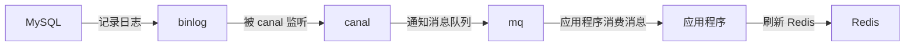

## 架构

```mermaid
graph LR
    mysql[MySQL]
    binlog[binlog]
    canal[canal]
    mq[mq]
    app[应用程序]
    redis[Redis]

    mysql --记录日志--> binlog
    binlog  --被 canal 监听--> canal
    canal --通知消息队列--> mq
    mq --应用程序消费消息--> app
    app --刷新 Redis--> redis

```