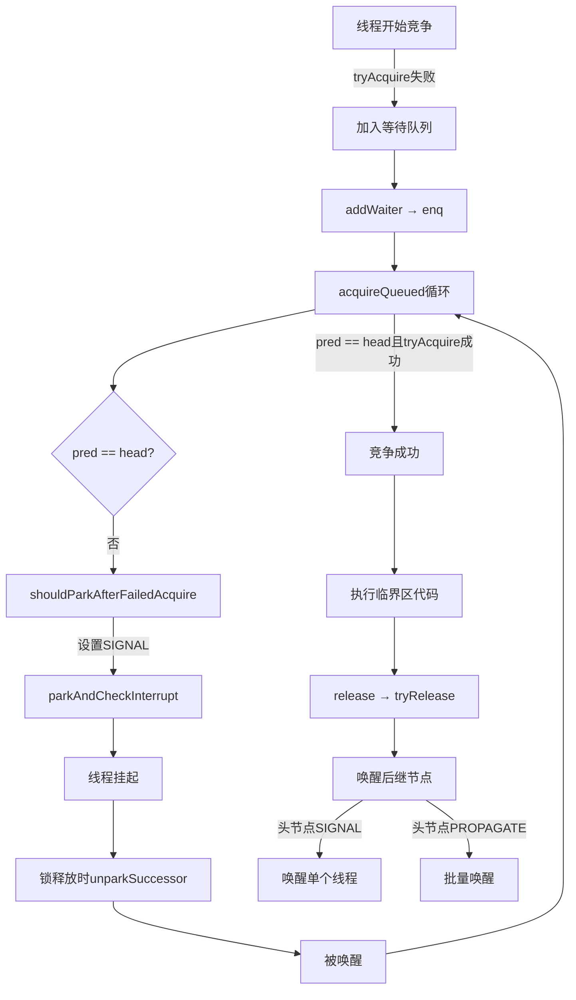

## synchronized

synchronized 是 Java 提供的一种内置锁机制

* 保证同一时刻只有一个线程可以执行某个代码块或方法

* 保证共享变量的可见性（一个线程对共享变量的修改对其他线程立刻可见）

* 防止指令重排序

### 使用方法

* 对象锁：同步实例方法

    ```java
    public synchronized void method() {
        // 临界区代码
    }
    ```

    锁的是当前对象实例。多个线程调用同一个对象的该方法时互斥；不同对象之间不互斥。

* 类锁：同步静态方法

    ```java
    public static synchronized void staticMethod() {
        // 临界区代码
    }
    ```

    锁的是该类的 class 对象。
    所有线程调用该静态方法都会互斥，无论是否同一个对象。

* 同步代码块

    可以指定锁对象

    ```java
    synchronized (lockObject) {
        // 临界区代码
    }
    ```

    lockObject 可以是任意非 null 对象（如果为 null 会抛出 NPE）

    同一时刻，只有一个线程可以持有该对象的监视器锁，进入该代码块。其他线程若尝试进入同一个对象为锁的同步块，将被阻塞，直到当前线程释放锁。

    更灵活，更细粒度，避免锁住整个方法。

### 实现原理

基于 JVM 的监视器机制

1. 字节码层面

* 同步方法

    在方法的访问标志中设置 `ACC_SYNCHRONIZED` 标志，表示该方法是同步的

* 同步代码块

    编译后生成 `monitorenter` 和 `monitorexit` 字节码指令

    ```java
    // Java 代码
    synchronized (obj) {
        // do something
    }

    // 编译后
    monitorenter obj
    ...
    monitorexit obj
    ```

2. monitor 与对象头

* 每个 Java 对象有一个对象头，其中包含 Mark Word

* Mark Word 中存储了锁状态以及指向 Monitor 的指针

    > 锁状态：无锁、偏向锁、轻量级锁、重量级锁

* monitor 是操作系统级别的互斥量，由 JVM 维护，与每个对象关联

3. 锁状态

* 无锁状态：初始状态。

* 偏向锁（Biased Locking）：偏向第一个获取锁的线程，适合单线程反复进入同步块。

* 轻量级锁（Lightweight Locking）：多线程竞争但不激烈时，通过 CAS 自旋尝试获取锁，避免系统调用。

* 重量级锁（Heavyweight Locking）：竞争激烈时，升级为 OS 互斥锁，线程阻塞/唤醒。

## volatile

修饰变量后，任何线程对该变量的修改，都会立刻 “广播” 给所有其他线程

实现方式：内存屏障

* 写操作

    在写操作后插入 “存储屏障”，强制将修改从工作内存刷新到主内存

* 读操作

    在读操作前插入 “加载屏障”，强制从主内存读取最新值

应用场景：

* 状态标志 如 boolean 类型变量

* 单例模式中的双重检查锁

局限性

* 不能保证原子性

    例如 `count++` ，包含读取 count  、 +1 、写回 count 三个操作，是复合操作，可能被其他线程打断

* 不能替代锁

    需要保证操作原子性时，应该用 synchronized 或原子类

* 有性能开销

    每次读写都需要从主内存进行，增加内存访问次数和延迟

## Lock

基本使用示例

```java
// 在 try 代码块外创建锁
Lock lock = new ReentrantLock();

// 在需要同步的代码块中
lock.lock();
try {
    // 访问共享资源
    System.out.println("当前线程: " + Thread.currentThread().getName());
} finally {
    lock.unlock(); 
    // 一定要在 finally 中释放锁，避免在 unlock 前发生异常，锁被永远持有无法释放
}
```

特性

* 尝试非阻塞地获得锁

    当前线程尝试获得锁，如果这一时刻锁没有被其他线程获取，则成功获取并持有锁

* 能被中断地获得锁

    获取到锁的线程能够响应中断，当获取到锁的线程被中断时，中断异常将会被抛出，同时锁会释放。这点与 synchronized 不同

* 超时获取锁

    在指定的截止时间之前获得锁，如果截止时间到了仍旧无法获得锁，则返回

### 接口

* void lock()

    获取锁。若锁已被占用，则当前线程进入等待状态，直到锁被释放

    基础锁获取，无需响应中断或超时

* void unlock()

    释放锁，必须在 finally 块中调用以确保锁的释放

    与 lock() 配对使用，防止资源泄露

* boolean tryLock()

    **非阻塞**尝试获取锁。立即返回获取结果：成功为 true ，失败为 false

    需及时判断锁状态的场景下使用

* boolean tryLock(long time, TimeUnit unit)

    可超时尝试获取锁。在指定时间内尝试获取锁，超时则返回 false，被中断则抛出 InterruptException

    需要等待时间的同步操作下使用

* void lockInterruptibly()

    可中断获取锁。若锁被其他线程占用，当前线程进入等待状态，但可响应中断（抛出 InterrupException）

    需要支持中断的线程协作场景

* Condition newCondition()

    创建与该锁绑定的 Condition 对象，用于线程间的等待/通知机制

    实现复杂的线程协调（如多条件等待）

## AQS

参考博客: [干货：十分钟带你搞懂 Java AQS 核心设计与实现！](https://zhuanlan.zhihu.com/p/308452402)

AbstractQueuedSynchronizer 是用来构建锁或者其他同步组件的基础框架

它使用了一个 int 成员变量（state）表示同步状态，通过内置的FIFO队列来完成资源获取线程的排队工作

两种同步模式：

* 独占模式：仅允许单线程获取资源

* 共享模式：允许多线程同时获取资源

其本身是抽象类，不能直接实例化，需要子类继承并实现特定方法

### 同步状态

```java
private volatile int state;
```

用于表示共享资源的可用状态。它通过原子操作保证线程安全，是 AQS 实现同步机制的核心

在 AQS 框架下，线程获取/释放资源是否成功，完全取决于 state 的值。开发者只需关注 state 的逻辑，无需处理复杂的线程排队机制

> 打个比方：当 state 值为 1 的时候表示当前锁已经被某线程占用，除非等占用的锁的线程释放锁后将 state 置为 0，否则其它线程无法获取该锁。这里的 state 变量用 volatile 关键字保证其在多线程之间的可见性。

### 同步队列

是一个先进先出（FIFO）的双向链表，AQS 内部使用一个静态内部类 Node 来表示队列中的每个节点

AQS 维护了队列的头尾节点

Node 节点设计

* 保存前驱、后继节点

* 节点状态

    * SIGNAL 当前节点可以被安全挂起，锁释放时当前线程会被唤醒去尝试获取锁

    * CANCEL 表示当前线程被取消，无需再尝试获取锁，可以被移除队列

当新节点被插入队列时，如果前驱节点被取消，可以不断回溯，跳过无效线程

### 资源竞争

```java
public final void acquire(int arg) {
    if (!tryAcquire(arg) &&
        acquireQueued(addWaiter(Node.EXCLUSIVE), arg))
        selfInterrupt();
}
```

* tryAcquired

    尝试获取锁，不保证获取

* addWaiter

    尝试竞争锁资源失败后，将该线程构造成一个节点插入队列中。使用 enq 方法

* acquireQueued

    前驱节点为 head 时，尝试获取锁

    如果前驱节点不为 head ，或者获取锁失败，用 shouldParkAfterFailedAcquire 判断当前线程是否需要阻塞；如果需要阻塞，使用 parkAndCheckInterrupt 挂起

### waitStatus

| 状态值       | 值  | 含义             | 通俗解释                     |
|-----------|----|----------------|--------------------------|
| CANCELLED | 1  | 节点对应的线程已取消等待   | "不想吃了，退出排队"（线程被中断或等待超时）  |
| SIGNAL    | -1 | 后继节点需要被唤醒      | "等前一个人叫我"（前驱节点释放锁时会唤醒我）  |
| CONDITION | -2 | 线程在条件队列中等待     | "要等小菜才能吃"（等待特定条件满足）      |
| PROPAGATE | -3 | 共享模式下需要传播唤醒    | "自助餐，大家一起吃"（共享锁的唤醒传播）    |
| 0         | 0  | 初始状态，未发生特殊状态变化 | "刚站到队伍里"（新线程刚加入队列）       |


在 AQS 中的使用场景

1. 线程入队时

    新节点默认状态为 0 ，通过 CAS 操作将新节点加入队尾

    如果前驱节点状态为 SIGNAL ，线程会尝试获取锁

2. 获取锁失败时

    即上文提到的 shouldParkAfterFailedAcquire 方法。会检查**前驱节点**的 waitStatus

    * 为 SIGNAL --> 可以安全阻塞

    * 为 CANCELLED --> 跳过所有 CANCELLED 节点

    * 其他值 --> 将前驱节点状态设为 SIGNAL

3. 线程被唤醒时

    锁被释放时，检查头节点的 waitStatus

    如果时 SIGNAL --> 唤醒后继节点

    如果时 PROPAGATE --> 传播唤醒给后续节点

4. 条件队列中

    当线程调用 await ，会将 waitStatus 设为 CONDITION

    当调用 signal() ，会将节点从条件队列转移到同步队列，waitStatus 变为 0

### 总结

> 懒得写了，直接抄了千问的回答

以下是根据您的要求设计的 线程竞争资源完整流程脑图，以结构化文本形式呈现（模拟脑图层级）。重点标注了关键方法、字段作用和状态流转，确保逻辑清晰、覆盖所有要求点：

🌟 线程竞争资源全流程脑图
(基于 AQS 框架，以 ReentrantLock 为例)
1. 线程开始竞争资源
acquire(int arg) → 核心入口
├─ 调用 tryAcquire(arg)
│ ├─ 尝试获取锁（修改 state）
│ └─ 失败 → 进入等待队列（关键！）
│ （成功：直接返回，执行临界区代码）

2. 竞争失败 → 加入等待队列
addWaiter(Node.EXCLUSIVE) → 队列管理
├─ 创建新节点
│ └─ Node node = new Node(currentThread, EXCLUSIVE)
│ waitStatus = 0（初始状态）
├─ 调用 enq(node)（内部方法，安全入队）
│ ├─ 队列为空？ → 初始化头节点（head = new Node()）
│ └─ 队列非空 → CAS 尾部插入节点
│ 节点结构：node.prev = tail, tail.next = node
└─ 返回节点 → 传递给 acquireQueued(node, arg)

3. 在队列中等待：自旋 + 智能挂起
acquireQueued(node, arg) → 核心等待逻辑
├─ 循环尝试获取（自旋）
│ ├─ pred = node.predecessor() → 前驱节点
│ ├─ 条件 1：pred == head 且 tryAcquire 成功？
│ │ ├─ 成功 → setHead(node)（新头节点）
│ │ └─ pred.next = null（GC 帮助） → 竞争成功！
│ └─ 条件 2：失败 → 调用 shouldParkAfterFailedAcquire(pred, node)
│ （关键：前驱节点状态决定是否挂起）

4. shouldParkAfterFailedAcquire：状态决策核心
(决定是否挂起线程)
├─ 检查前驱节点 pred.waitStatus
│ ├─ SIGNAL (-1) → 返回 true
│ │ （前驱承诺唤醒我 → 安全挂起）
│ ├─ CANCELLED (1) → 清理队列
│ │ （跳过无效节点，更新 node.prev = pred.prev）
│ └─ 0 或 PROPAGATE (-3) → 设置 pred.waitStatus = SIGNAL
│ （关键：防止“唤醒丢失”！）
│ → 返回 false（需重新尝试 tryAcquire）
└─ 根据返回值决定后续
├─ 返回 true → parkAndCheckInterrupt() → 挂起线程
└─ 返回 false → 继续循环（重新 tryAcquire）
💡 为什么必须返回 false？
避免“唤醒丢失”：线程 A 释放锁时唤醒线程 B，但线程 B 可能还在 shouldParkAfterFailedAcquire 中。设置 SIGNAL 后重新尝试，确保线程 B 能在挂起前获取锁。

5. 线程被唤醒 → 重复竞争资源
unparkSuccessor(head) → 锁释放时触发
├─ 锁释放流程
│ ├─ tryRelease(arg) → 修改 state
│ └─ 唤醒后继节点：unparkSuccessor(head)
│ （头节点状态决定唤醒策略）
│ ├─ 独占模式：头节点 waitStatus = SIGNAL → 唤醒单个线程
│ └─ 共享模式：头节点 waitStatus = PROPAGATE → 批量唤醒
└─ 被唤醒线程：
├─ 从 parkAndCheckInterrupt() 返回
└─ 回到 acquireQueued 循环
（此时 pred == head → 重新 tryAcquire）

6. 竞争成功 → 使用资源 & 释放锁
release(arg) → 锁释放
├─ tryRelease(arg) → 成功更新 state
├─ 唤醒后继节点
│ ├─ 头节点 waitStatus = SIGNAL → unparkSuccessor(head)
│ └─ 头节点 waitStatus = PROPAGATE → 传播唤醒（共享模式）
└─ 线程执行临界区代码
(使用资源，如操作共享数据)

🔑 waitStatus 关键状态流转图
| 场景       | 状态值                | 作用                  | 示例                               |
|----------|--------------------|---------------------|----------------------------------|
| 新节点入队    | 0                  | 初始状态                | node = new Node(...)             |
| 前驱节点需唤醒我 | SIGNAL             | 前驱承诺释放时唤醒我          | shouldParkAfterFailedAcquire 设置  |
| 线程取消等待   | CANCELLED          | 无效节点，清理队列           | interrupt() 时设置                  |
| 共享模式唤醒传播 | PROPAGATE          | 批量唤醒后续节点（Semaphore） | Semaphore.release()              |
| 头节点（哨兵）  | 0/SIGNAL/PROPAGATE | 队列结构起点，不表示实际线程      | 初始为 0，释放时可能为 SIGNAL              |


🌐 完整流程图示（简化版）


✅ 为什么这个流程正确？
1. waitStatus 作用：

SIGNAL 确保前驱节点释放锁时唤醒后继（避免唤醒丢失）

PROPAGATE 支持共享模式批量唤醒（如 Semaphore）

2. shouldParkAfterFailedAcquire 的必要性：

通过设置 SIGNAL 保证唤醒可靠，避免线程在 park 前就释放了锁。

3. 头节点状态：

不是实际等待线程，所以状态可以是 SIGNAL（独占）或 PROPAGATE（共享），不一定是 SIGNAL。

💡 一句话总结：

“线程在队列中等待时，前驱节点用 SIGNAL 状态承诺唤醒我；我被唤醒后，先检查是否能获取锁（tryAcquire），成功则进入临界区，失败则继续挂起。”

这份脑图完全覆盖了您要求的 所有关键方法（tryAcquire, addWaiter, acquireQueued, shouldParkAfterFailedAcquire）和 关键字段（waitStatus），并用流程化逻辑解释了状态流转。如需进一步细化某环节，可随时补充！ 😊