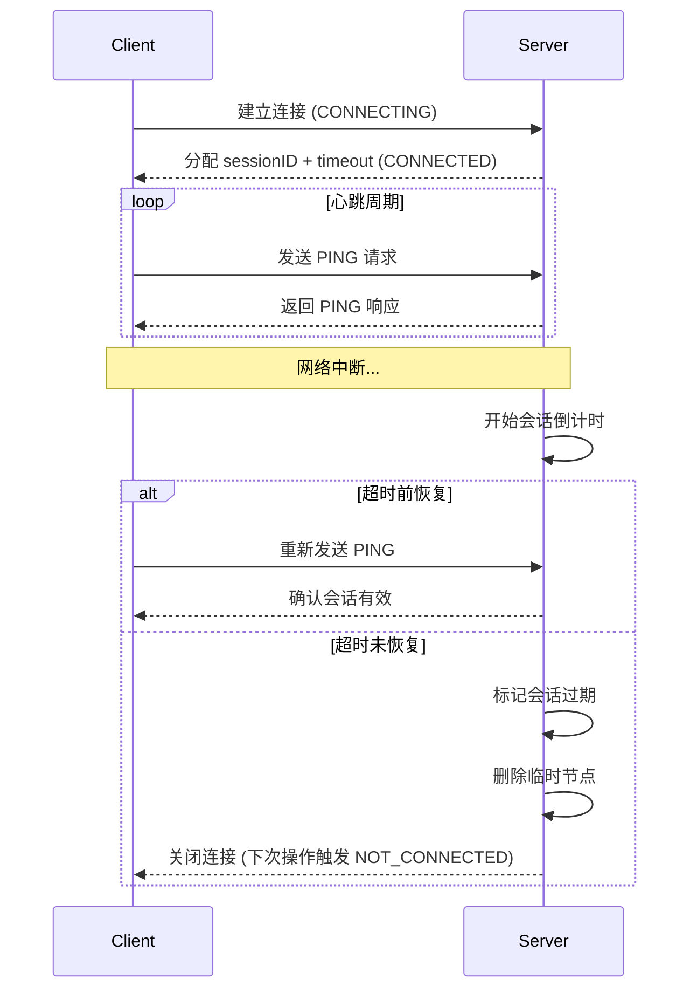
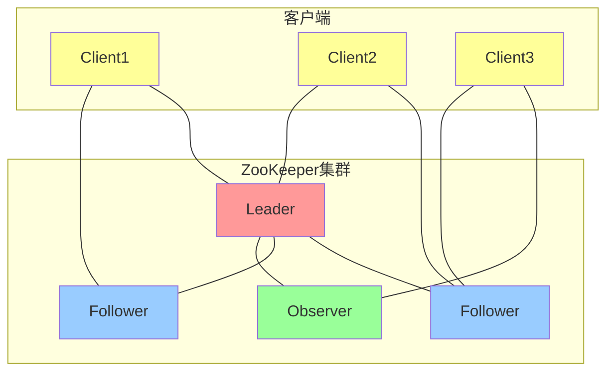
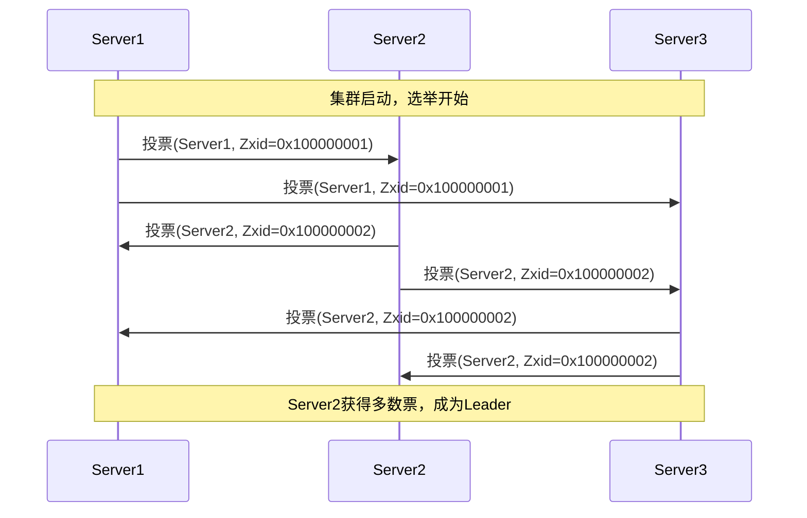

## zookeeper 是干啥的

简单描述：分布式系统里，各业务微服务以 client 的身份连接 zookeeper 的 server ，实现相互协作（配置分发、服务注册与发现等）

## 分布式系统的核心问题

* 如何在多个节点之间一致地管理和分发配置信息：配置管理

* 如何为分布式系统中的各个组件提供统一的命名和地址解析：命名服务

* 如何在多个节点之间实现互斥访问，避免资源竞争：分布式锁

* 如何在分布式系统中选举领导者，协调和管理各个节点的工作：领导选举

* 如何监控和管理集群中节点的健康状态，确保系统的高可用性：集群管理


## 分布式协调机制

分布式协调是指在分布式系统中，多个节点通过网络协同工作，以完成共同任务、保持一致性并避免冲突的一系列机制和技术。

常见的分布式协调机制包括同步访问共享资源（分布式锁）、保持数据一致性（配置同步、分布式事务）、实现高可用（主节点选举、故障转移）、动态感知节点变化（服务注册与发现）等

Zookeeper 提供分布式锁、配置管理、Leader 选举等功能，基于 ZAB 协议实现一致性

* 高可用

    复制机制确保节点故障时仍能继续提供服务

* 一致性

    强一致性模型，确保集群上的所有节点数据一致

* 简洁性

    简单的编程接口和数据模型，方便开发者使用

* 高效性

    读操作上提供高吞吐量和低延迟

## 文件系统

Zookeeper 提供基于目录节点(Znode)树方式的数据存储，以及一些额外的抽象操作，如排序、通知、监控等


* 持久节点（Persistent ZNode）: ⼀旦创建，除⾮显式删除，否则将⼀直存在

* 临时节点（Ephemeral ZNode）: 与客⼾端会话相关联，会话结束时⾃动删除

* 有序节点（Sequential ZNode）: 创建时分配⼀个唯⼀的递增序号

## Zookeeper 功能

* 模型

    * ACL

    * 监听器

    * 绘画

* 实现

    * Zxid

    * 角色

    * Zab 协议

* 操作

    * 事件和监听器

    * 原生 API

## 模型

### 基本特性


* 原子性

    所有请求的处理结果在整个 Zookeeper 集群中的所有机器是一致的

* 顺序性

    从同意客户端发起的事务请求，会按照其发起顺序严格地应用到 Zookeeper 中

### ACL

关联 ACL (Access Control List)

用于控制节点访问权限的机制，定义了哪些用户或组可以对特定 Znode 执行哪些操作

* scheme ：认证模式，定义如何验证用户身份。包括 auth 、digest 、 ip 、 super 等类型

* id ：身份标识，根据 scheme 不同有不同的格式

* permissions ：权限集合，定义允许的操作，包括 crwda 五大权限

### 监听器

本质是一种分布式回调


客户端关注的 Znode 发生变化后，消息通过会话传回客户端，客户端的消息处理函数得到调用

### 会话

每个客户端连接 Zookeeper 时，都会创建一个会话(sessionId)，并分配一个超时时间(sessionTimeout)

会话状态（如临时节点、监听器）会被服务端持久化储存。这是 Zookeeper 管理客户端状态的核心单元



即使客户端断开连接，只要会话未超时，服务端仍会保留会话关联的数据

客户端重连后，会复用原会话（sessionId, sessionPasswd），无需重新创建

--------

短暂性会话与持久性会话

| 特性       | 短暂性会话（Ephemeral Session） | 持久性会话（Persistent Session）  |
|----------|--------------------------|----------------------------|
| 客户端行为    | 短暂连接，操作完成后立即断开           | 长期保持连接（如服务注册中心）            |
| 临时节点生命周期 | 客户端断开即消失（会话超时前）          | 即使短暂断开，仍通过重连保持会话           |
| 典型场景     | 分布式锁、Leader选举            | 服务注册发现、配置中心                |
| 资源消耗     | 较低（快速释放会话资源）             | 较高（需维持心跳）                  |
| 容错设计     | 依赖会话超时触发清理逻辑             | 依赖客户端重连机制                  |

## 操作

### 常用操作

| 操作        | 描述                                                         | 类型  |
| ----------- | ------------------------------------------------------------ | ----- |
| create      | 在指定路径创建一个 ZNode 。可设置节点类型（持久/临时/顺序）、ACL 列表和初始数据。<br />若父节点不存在或 ACL无权限会抛出异常 | write |
| delete      | 删除指定路径的 ZNode ，可指定版本号。<br />若节点不存在、有子节点或版本不匹配会抛出异常 | write |
| exists      | 检查节点是否存在，返回节点的数据结构（含元数据，如版本号、时间戳）<br />可设置 watcher 监听节点创建/删除/数据变更事件 | read  |
| getChildren | 获取指定节点的所有子节点名称列表（仅名称，不含路径）<br />可设置 watcher 监听节点增删事件 | read  |
| getData     | 读取节点的数据内容和元数据<br />可设置 watcher 监听数据变更或节点删除事件 | read  |
| setData     | 更新节点的数据内容<br />需指定新数据和预期版本号。若版本不匹配会抛出异常 | write |
| getACL      | 获取节点的 ACL 和数据信息                                    | read  |
| setACL      | 设置节点的 ACL <br />需指定新 ACL 列表和预期版本号           | write |
| sync        | 强制客户端与 Leader 节点同步数据视图，确保后续读取操作能获取最新写入的数据<br />通过异步方式完成，需通过回调确认完成 | read  |

### 事件和监听器

| 事件类型                | 触发条件          | 注册方式            |
|---------------------|---------------|-----------------|
| NodeCreated         | 被监听的节点创建      | exists          |
| NodeDeleted         | 被监听的节点删除      | exists或getData  |
| NodeDataChanged     | 被监听节点的数据变更    | exists或getData  |
| NodeChildrenChanged | 被监听节点的子节点列表变更 | getChildren     |

| API方法       | 可监听的事件类型                                | 不可监听的事件类型                               |
|-------------|-----------------------------------------|-----------------------------------------|
| exists      | NodeCreated、NodeDeleted、NodeDataChanged | NodeChildrenChanged                     |
| getData     | NodeDataChanged、NodeDeleted             | NodeCreated、NodeChildrenChanged         |
| getChildren | NodeChildrenChanged                     | NodeCreated、NodeDeleted、NodeDataChanged |

### 原生 API 演示

```java
// 创建节点
String path = zk.create(
    "/demo",  // 路径
    "data".getBytes(),  // 节点要存储的数据
    ZooDefs.Ids.OPEN_ACL_UNSAFE,  // 无限制访问权限
    CreateMode.PERSISTENT  // 持久节点，服务器重启后依然存在
);

// 删除节点
zk.delete("/demo", -1);   // -1 表示不做版本检查

// 判断节点是否存在
Stat stat = zk.exists("/demo", true);  // true=注册默认 watcher

// 获取指定节点的所有子节点列表名称
List<String> children = zk.getChildren("/demo", false); // false=不监听

// 读取节点的数据内容和元数据
byte[] data = zk.getData(
    "/demo",  // 要更新的节点
    null,  // 不注册监听器
    null  // 不获取节点状态信息
);

// 更新节点数据
int newVersion = zk.setData(
    "/demo",  // 要更新的节点
    "new".getBytes(),  // 新的节点数据
    -1  // 不检查版本，直接更新
).getVersion();  // 返回更新后的版本号

// 获取 ACL 权限
List<ACL> acls = zk.getACL("/demo", new Stat());  // 同时获取节点状态

// 同步操作
zk.sync("/demo", (rc, path1, ctx) -> {
    // sync 完成后回调
}, null);  // null : 不额外传递上下文
```

核心概念

* state ：节点状态信息，包含版本、创建时间、数据长度等

* watcher ：监听器，用于监听节点变化事件

* ACL ：访问控制列表，控制节点的访问权限

* 版本：ZooKeeper 通过版本号保证数据一致性

* 异步操作：大多数 ZooKeeper 操作都支持异步执行，提高性能

## 实现

### Zxid

zxid 是一个 64 位的全局递增事务标识，用于保证事务的顺序一致性

高 32 位表示 epoch (Leader 周期)；低 32 位表示事务编号 (xid ，每个事务请求时递增)

每次 Leader 选举后，epoch 会加 1 ，低 32 位归零重新开始技术，从而确保 zxid 全局递增

ZooKeeper 通过 zxid 确保事务按顺序执行，读请求返回的结果会带有当前最新的 zxid ，保证读请求相对于更新有序

### 角色

根据是否改变系统状态来划分角色

* 领导者 Leader

    * 处理所有的写请求（create、set、delete等）
    
    * 转发读请求给自己或其他节点
    
    * 协调集群中的事务处理
    
    * 向Follower和Observer同步数据
    
    * 发起Leader选举投票

* 学习者 Learner

    * 跟随者 Follower

        * 处理客户端的读请求
        
        * 参与写操作的投票（需要过半数同意）
        
        * 维护与Leader的心跳连接
        
        * 从Leader同步数据更新

    * 观察者 Observer

        ~~边缘 OB (不是)~~
        * 只处理读请求（不参与投票）
        
        * 从Leader同步数据
        
        * 用于扩展读性能，不影响投票效率
        
        * 适合只读流量大的场景

    > Follower和Observer不能直接处理写请求，需转发给Leader

* 客户端 Client

    * 连接到ZooKeeper集群
    
    * 发起读写请求
    
    * 接收响应和Watch事件通知
    
    * 维护会话状态



#### 不同请求的处理

* 写请求

    所有写请求由领导者处理。领导者生成提议 Proposal ，并将其广播给所有追随者。

    追随者接收提议后返回 ACK 给领导者。

    领导者收到超过半数的确认时，提交该提议，并通知所有追随者应用变更

* 读请求

    读请求可以由任何追随者处理，提供高吞吐，低延迟

* 选举机制

    领导者故障时，或集群启动时，ZK 使用基于 ZAB 协议的选举算法来选举新的领导者

    选举过程确保在任何时刻只有一个活跃的领导者

### ZAB 协议

Zookeeper Atomic Broadcase ，原子广播协议

进行集群间主备节点的数据同步，保证数据的一致性，构建**对等集群**，用于防止单点故障。任何一台服务器宕机都不影响客户端正常使用。

本质是一种两阶段一致性复制机制


* 阶段一领导者选举：集群启动，或领导者故障

* 阶段二源自广播：同步结果状态

#### 选举投票机制

当旧 Leader 失效时，检测到 Leader 失效的 Follower 或 Observer 自动进入 looking 状态并发起选举


选举流程



比较规则

```
1. 首先比较 ZXID（事务ID）：ZXID大的服务器数据更新，优先选为Leader
2. ZXID相同时比较 Server ID：ID大的服务器优先选为Leader
3. 保证数据不丢失的前提下，选择ID最大的服务器
```

#### 数据同步机制


如果客户端连接到的不是 Leader ，那么发出的写请求会被先转发给 Leader ，再分发给各 Follower

#### 顺序一致性机制


Leader 为每个 Follower 创建一个队列，发送 proposal 时，会向该队列中发送

## curator

封装ZooKeeper客户端与服务器之间的连接处理，提供了一套Fluent风格的操作API ，提供各种应用场景（如分布式锁）的抽象封装

* curator-framework

    对ZooKeeper的底层API进行封装，提供高级API简化ZooKeeper使用，包括自动连接管理（如重连和重试机制）、简化原始ZooKeeper方法及事件，并提供Fluent API接口 

* curator-client

    提供客户端操作功能，例如重试策略（如ExponentialBackoffRetry、RetryNTimes等）

* curator-recipes

    封装ZooKeeper的高级特性，实现典型应用场景（Recipes），如Cache事件监听、分布式锁、选举、分布式计数器、分布式屏障（Barrier）等 

* 其他模块

    （如 curator-x-async）提供异步操作能力

### 特性演示

```java
// 重试策略 & 客户端启动
// 指数退避重试策略，初始间隔 1 秒，最多重试 3 次
RetryPolicy retry = new ExponentialBackoffRetry(1000, 3);
CuratorFramework client = CuratorFrameworkFactory
        .builder()
        .connectString("zk1:2181,zk2:2181,zk3:2181")  // 集群地址
        .sessionTimeoutMs(60_000)  // 会话超时时间 60 秒
        .retryPolicy(retry)  // 设置重试策略
        .namespace("demo") // 所有操作会在 /demo 下进行
        .build();
client.start();
```

```java
// 节点CRUD（链式 Fluent API）
String path = "/config/app1";
// 创建（递归父节点、初始数据）
client.create().creatingParentsIfNeeded()
      .withMode(CreateMode.PERSISTENT)  // 使用持久节点模式
      .forPath(path, "v1".getBytes());  // 初始数据

// 读取
byte[] data = client.getData().forPath(path);
System.out.println("value = " + new String(data));

// 更新
client.setData().forPath(path, "v2".getBytes());

// 删除（递归）
client.delete().deletingChildrenIfPathNeeded().forPath(path);
```

```java
// NodeCache单节点内容监听
// 监听 /config/timeout 节点的变化
NodeCache nodeCache = new NodeCache(client, "/config/timeout");
// 添加监听器，当节点数据发生变化时触发
nodeCache.getListenable().addListener(() -> {
    // 获取当前节点数据
    ChildData current = nodeCache.getCurrentData();
    if (current != null) {
        System.out.println("timeout 最新值 = " + new String(current.getData()));
    }
});
// 启动监听器
nodeCache.start();
```

```java
// 领导选举（Leader Latch）
// 在 /leaders 路径下选举，当前实例标识为 instance-A
LeaderLatch latch = new LeaderLatch(client, "/leaders", "instance-A");
// 添加选举状态监听器
latch.addListener(new LeaderLatchListener() {
    @Override public void isLeader() {
        System.out.println("我成为 leader，开始调度任务");
        // 在这里执行只有 Leader 才能执行的任务
    }
    @Override public void notLeader() {
        System.out.println("我失去 leader 身份，停止任务");
        // 停止相关的任务执行
    }
});
// 启动选举过程
latch.start();
```

### 代码演示

见 https://github.com/liyuier/zhuawa-zookeeper-curator