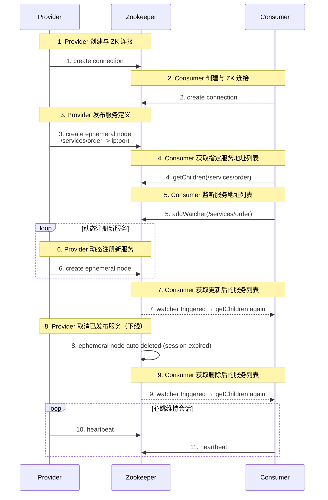

## 典型应用

* 配置中心

* 注册中心

* 分布式锁

* 分布式队列

* 负载均衡

* master 选举

## 配置中心


核心功能：和客户端的配置交互，屏蔽不同配置仓库在技术实现上的差异

实现方式：文件系统、版本控制系统、自定义存储等

最佳实践：配置管理和 CI/CD 的各项模式和实践

基于 Zookeeper 实现分布式环境下配置信息共享管理


## 注册中心

三大角色

* 注册中心：服务端角色

* 服务提供者：注册中心的客户端

* 服务消费者：注册中心的客户端


两大操作：注册操作 + 订阅操作

关键技术：服务变更通知机制

### 服务订阅发布流程



### 变更通知机制

消费者通过 watcher 机制监控服务配置状态

### zookeeper 与 dubbo


* 服务容器负责启动、加载、运行服务提供者

* 服务提供者在启动时向注册中心注册自己提供的服务

* 服务消费者在启动时向注册中心订阅自己需要的服务

* 注册中心返回服务提供者地址列表给消费者，如果有变更，注册中心将基于长连接推送变更数据给消费者

* 服务消费者从提供者地址列表中选一台提供者进行调用

总结

* 注册中心负责服务地址的注册与查找（目录服务）

* 服务提供者向注册中心注册其提供的服务

* 服务消费者向注册中心获取服务提供者地址列表

* 注册中心、提供者、消费者三者之间均为长连接

* 注册中心感知提供者宕机并推送事件通知消费者

* 注册中心宕机，消费者使用本地缓存提供者列表

## 分布式锁

不同的分布式锁的实现方案

* 关系型数据库

    直接使用数据库的 `select ... for update` 机制和数据版本机制来分别实现悲观锁和乐观锁

* zookeeper 和 curator

    zk 提供了一整套完整的分布式锁方案。 curator 在 zk 的基础上进行了封装，实现了即插即用的分布式读写锁

* redis 和 redisson

    redis 底层提供了分布式锁的实现能力，而 redisson 是一款基于 reids 实现的 java 分布式对象和服务的框架，提供了多种分布式锁的实现方式

zookeeper 基本结构


### zk 实现分布式锁方案

* 临时节点

    所有访问 zk 的客户端都会注册为节点

* 全局事务ID

    每个节点在创建时都会生成一个唯一的递增序列号

* 顺序访问

    客户端获取节点列表并排序，如果自己节点的编号最小则获得锁

* 监听机制

    反之监听排在自己前面的节点，如果监听到该节点被删除则重新执行排序

### 代码演示

```java
public static void doLock(CuratorFramework client){

    String CURATOR_LOCK = "/curatorLock"; //Zookeeper中的锁节点

    // 实例化分布式锁：可重入锁
    InterProcessMutex lock = new InterProcessMutex(client, CURATOR_LOCK);
    try {
        // 判断是否获取到了zk分布式锁
        if(lock.acquire(5, TimeUnit.SECONDS)){  // 最多等待 5 秒，如果超时仍未获取到锁，则返回 false           
            // 业务操作                
        }
    } catch (Exception e) {
        e.printStackTrace();
    } finally {
        // 释放锁
        if (lock.isOwnedByCurrentThread()) {
            lock.release();
        }
    }
}
```

### 更完整的代码示例

见 https://github.com/liyuier/zhuawa-zookeeper-curator

### InterProcessMutex 与 InterProcessSemaphoreMutex

* InterProcessMutex

    排他锁，同一时刻，只能由一个客户端持有锁。

    适用严格的串行执行场景：定时任务调度、库存扣减、数据迁移等

* InterProcessSemaphoreMutex

    信号量锁，同一时刻，最多 N 个客户端可以持有锁（N 由 maxLeases 参数指定）

    适用有限并发控制场景：数据库连接池、API 调用限流、批量任务并发控制

### 分布式锁选型


对于可靠性要求较高的场景，优先选择 zk 实现分布式锁

#### CAP 理论

* Consistency

    一致性：所有节点在同一时间看到的数据完全一致

* Availability

    可用性：系统对任何有效请求都能在合理时间内给出响应

* Partition Tolerance

    分区容错性：系统在部分节点间无法通信的情况下仍能继续运行

P 是必须要求的，因此分布式系统需要在 C 和 A 之间取舍。zk 选择的是 CP ，在 Leader 选举过程中，或半数以上的机器不可用等情况下服务不可用；redis 选择的是 AP . spring cloud 选择的也是 AP

## 高可用架构

* 热备方案

    一个 active master ，若干 standby master

    当 active master 失效时，从若干 standby master 中挑选一个作为 active master

* 共享存储 HA

    active master 不断写入信息

    standby master 不断同步信息

    主备切换时，选中的 standby master 保证信息完全同步之后再切换到 active master

### yarn 架构

resource manager

* 负责集群中所有资源的统一管理和分配

* 接收来自各个节点的资源汇报信息

* 吧这些信息按照一定的策略分配给各个应用程序

resource manager HA

多个 resource manager 共存，其中一个处于 active 状态

当 Active RM 失效时，处于 standby 的 RM 就会通过竞争选举产生新的 active 节点

工作模式

1. 创建锁节点

    所有的 RM 在启动时，都会去竞争写一个 Lock 子节点，该节点为临时节点

    zk 保证只有一个 RM 能成功创建。创建成功的那个 RM 就切换为 active 状态，没有成功的则为 standby 状态

2. 注册 watcher 监听

    所有的 standby 状态的 RM 节点都会对 active 状态的 RM 节点注册一个节点变更的 watcher 监听，以感知 active 状态的 RM 节点的运行状态

3. 完成主备切换

    当 active 状态的 RM 出现诸如宕机或重启的异常情况时，其在 zk 上连接的会话就失效，因此该节点会被删除。

    此时其余 standby 状态的 RM 就会接收到来自 zk 服务端的 watcher 事件通知，然后会重复步骤 1 的操作