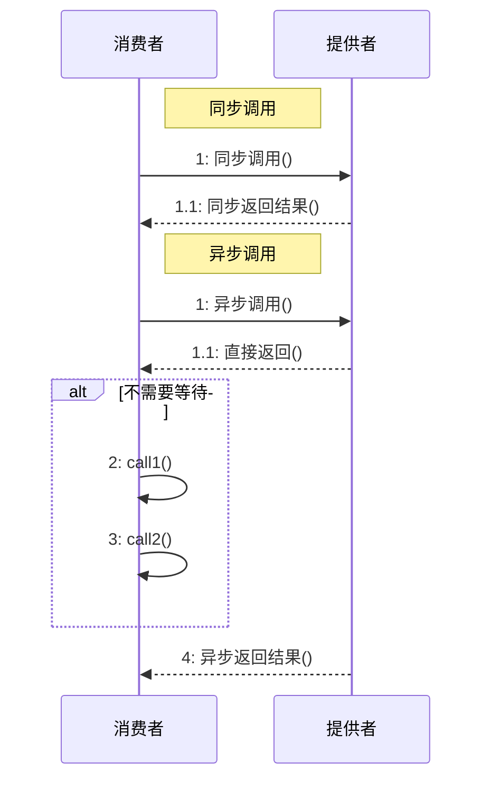
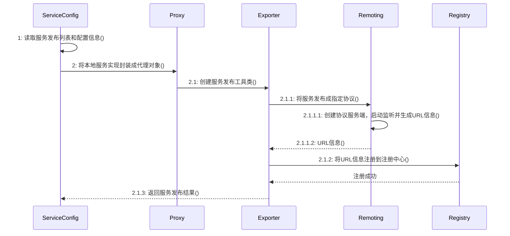

## RPC 基础架构和组成结构

### 远程调用与 RPC 架构


远程调用是一切分布式系统的基础，包含分布式系统基本功能组件：

-   网络通信

-   序列化/反序列化

-   传输协议

-   服务调用

Remote Process Call：远程过程调用

### 远程调用的演进


黄色部分为第一阶段，绿色部分为第二阶段新增环节

客户端

-   Client : 负责导入远程接口的代理实现

-   Proxy : 代理远程接口的具体实现

-   Caller : 负责发送请求并等待结果

-   Connector : 负责维持连接通道，和发送数据到服务端

服务端

-   Server : 负责导出远程接口

-   Invoker : 负责调用服务端接口的具体实现

-   Acceptor : 负责接收客户端请求并返回结果

-   Processor : 负责控制调用过程，包括管理线程池等

### 代码演示

见 https://github.com/liyuier/zhuawa-rpc-base

### RPC 技术组件

远程调用四大组件

-   网络通信

-   序列化

-   传输协议

-   调用方式

### 网络通信

连接方式

* 长连接

    TCP 连接建立后，可以连续发送多个数据包。节省资源，时延较小

* 短连接

    TCP 连接建立后，数据包传输完成即关闭连接。结构简单

Dubbo 和 Spring Cloud 分别是长连接和短连接的代表性实现框架

---------

I/O 模型

1. 阻塞 IO

    当程序发起 IO 操作，会一直等待直到操作完成

    简单容易理解，但等待期间 CPU 资源被浪费

    每个连接需要一个独立的线程

2. 非阻塞 IO

    程序不断轮询检查 IO 是否就绪

    不会阻塞主线程，需要频繁检查状态，CPU 利用率高

    实现复杂，需要循环检查

3. IO 复用

    使用 epoll 等系统调用同时监控多个文件描述符
    
    可以同时处理多个连接

    减少了线程开销

4. 信号驱动 IO

    注册信号处理器，当 IO 就绪时发送信号

    通过信号通知，需要处理信号中断

    使用较少，主要在 Unix 系统中

5. 异步 IO

    发起 IO 后立即返回，完成后通过回调或事件通知

    最高效的 IO 模型

    完全非阻塞

    实现复杂，需要操作系统支持

### 序列化

* 序列化：将对象转化为字节数组，用于网络传输、数据持久化等用途

* 反序列化：把从网络、磁盘等读取的字节数组还原成原始对象，方便后续业务逻辑操作

### 传输协议

出于性能和扩展性的考虑，RPC 框架通常会设计自定义的传输协议

* 自定义通信模型和消息定义

* 支持点对点长连接通信

* 使用 NIO 模型进行非阻塞式通信

* 提供可扩展编解码框架和多种序列化方式

#### Dubbo

采用单一长连接和 NIO 异步通讯，适用于小数据量大并发的服务调用

### 调用方式



## 引入 Dubbo 框架

### 面向生产的 RPC 框架

* 一对一远程访问基础组件

* 远程访问本地化组件

* 集群访问和负载均衡组件

* 服务治理和监控组件

### 引入 Dubbo 框架


### Dubbo 远程调用元素

* 网络通信

    * Netty

    * Mina

    * Grizzly

* 传输协议

    * Dubbo

    * RMI

    * Hessian

* 持久化

    * Hessian

    * Dubbo

    * Json

    * Java

* 调用方式

    * 同步

    * 异步

    * 同步转异步

### Dubbo 服务治理 - 基本模型


* 三大角色：两种客户端角色，一种服务端角色

* 两大操作：注册操作 + 订阅操作

* 关键技术：服务变更通知机制

### dubbo 服务治理 - zookeeper

```xml
<dubbo:registry address="zookeeper://10.20.153.10:2181"/>
```


zookeeper 应用见 [Zookeeper 应用场景与实现策略](https://yuier.com/posts/020-zookeeper-apply)

### dubbo 服务治理 —— 功能特性

```xml
<!-- 开发测试支持：直连、只订阅、只注册 -->
<dubbo:reference id="xxxService" interface="com.alibaba.xxx.XxxService"    
    url="dubbo://localhost:20890" />
<dubbo:registry address="10.20.153.10:9090" register="false" />
<dubbo:registry address="10.20.141.150:9090" subscribe="false" />

<!-- 多注册中心配置 -->
<dubbo:registry id="hangzhouRegistry" address="10.20.141.150:9090" />
<dubbo:registry id="qingdaoRegistry" address="10.20.141.151:9010" default="false" />

<!-- 服务注册到多个注册中心 -->
<dubbo:service interface="com.alibaba.hello.api.HelloService" version="1.0.0"
    ref="helloService" registry="hangzhouRegistry,qingdaoRegistry" />

<!-- 引用中国站服务 -->
<dubbo:reference id="chinaHelloService" interface="com.alibaba.hello.api.HelloService"
    version="1.0.0" registry="chinaRegistry" />
<!-- 引用国际站服务 -->
<dubbo:reference id="intlHelloService" interface="com.alibaba.hello.api.HelloService"
    version="1.0.0" registry="intlRegistry" />
```

## 服务发布流程



上图是一个 UML 序列图，展示了 dubbo 框架中服务发布的流程。

* ServiceConfig：服务配置类，用户通过它来定义要发布的服务

* Proxy：代理层，负责将本地实现封装成代理对象，对外提供远程调用接口

* Exporter：导出器，负责将服务以某种协议（如 dubbo、rest）进行发布

* Remoting：远程通信层，负责创建网络监听端口、生成 URL 信息等

* Registry：注册中心，用于将服务的地址信息注册到 Zookeeper 等注册中心

### 服务发布协议

自研 dubbo 协议
 
* 连接个数：单连接 

* 连接方式：长连接 

* 传输协议：TCP 

* 传输方式：NIO异步传输 

* 序列化：Hessian二进制序列化 

* 适用范围：小数据量、消费者数远大于提供者 

* 适用场景：常规远程服务方法调用


```xml
<!-- 协议配置：指定使用Dubbo协议 -->
<dubbo:protocol name="dubbo"/>

<!-- 服务实现类的Spring Bean定义 -->
<bean id="userService" class="com.duyi.dubbo.demo.provider.UserServiceImpl"/>

<!-- 服务暴露：将UserService接口的服务实现暴露出去 -->
<dubbo:service interface="com.duyi.dubbo.demo.UserService" ref="userService"/>
```

## 服务引用流程

* 导入服务提供者接口 API 和服务信息

* 生成远程服务的本地动态代理对象

* 本地 API 调用转换成远程服务调用，返回调用结果

```xml
<!-- 声明一个远程服务。 
id 是在 spring 容器中的唯一标识符，用于后续在其他 Bean 中通过 ref 引用。名称可以任意指定，但最好与接口保持一致
interface 是要引用的远程服务接口全限定名 -->
<dubbo:reference id="xxxService" interface="com.xxx.XxxService" />

<!-- 定义 spring 容器中的一个 bean ，用于注入远程服务代理
bean.id: 定义 spring 容器中一个 bean
bean.class: 指定要实例化的 Java 类的全限定名，它将会是业务逻辑的实现类
property.name: 要注入的属性名，对应 XxxAction 类中的成员变量名（如：private XxxService xxxService;）
property.ref: 引用 Spring 容器中另一个 Bean 的 id ，这里引用的是上面定义的 xxxService-->
<bean id="xxxAction" class="com.xxx.XxxAction">
    <property name="xxxService" ref="xxxService" />
</bean>
```

```java
// 业务代码实现

// 服务接口定义
public interface XxxService {
    String sayHello(String name);
}

// 业务逻辑实现
public class XxxAction {
    private XxxService xxxService; // 与配置中的 property name 对应
    
    // setter 方法用于 Spring 注入
    public void setXxxService(XxxService xxxService) {
        this.xxxService = xxxService;
    }
    
    public void doSomething() {
        // 通过注入的代理对象调用远程服务
        String result = xxxService.sayHello("World");
        System.out.println(result);
    }
}
```

## Dubbot 基本使用方法

```java
// 标记此类为 dubbo 服务提供者，框架会自动将其暴露为远程服务
@DubboService
public class AccountServiceImpl implements AccountService

@Configuration
@EnableDubbo(scanBasePackages = "com.dubbo.demo.provider")  // 启动 dubbo 功能，扫描此包下添加有 @DubboService 注解的类
@PropertySource("classpath:/spring/dubbo-provider.properties")  // 加载外部配置文件
static class ProviderConfiguration {
    @Bean
    public RegistryConfig registryConfig() {
        RegistryConfig registryConfig = new RegistryConfig();
        registryConfig.setAddress("zookeeper://127.0.0.1:2181");  // 创建 RegistryConfig 对象并设置 zk 地址
        return registryConfig;
    }
}

@Component("accountServiceClient")  // 将本类注册为 Bean
public class AccountServiceClient {
    @DubboReference
    private AccountService accountService;  // 注入远程代理对象。这里注入的是代理对象，不是真实实现
 
    public Account getAccountByAccountName(String name) {
        return accountService.getAccountByAccountName(name);
    }
}
```
