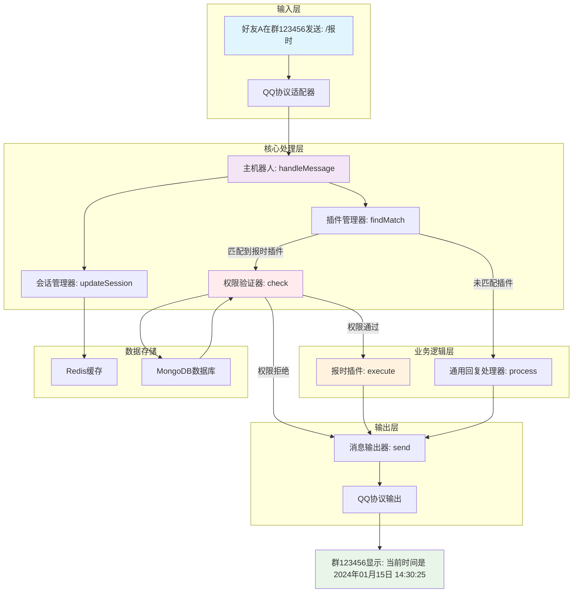
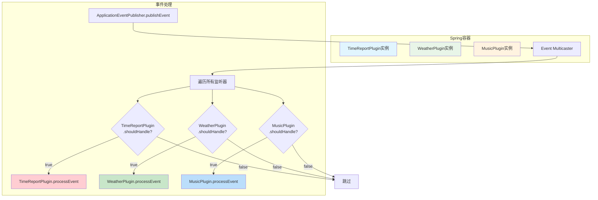
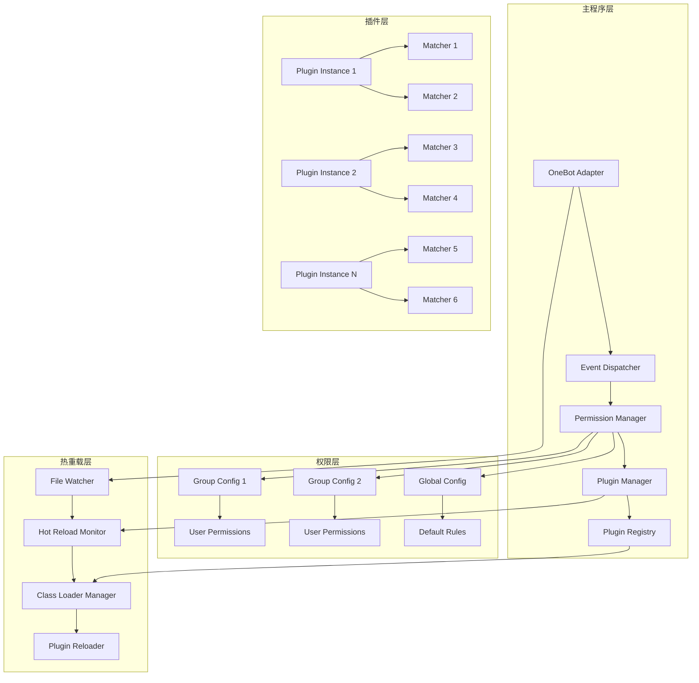
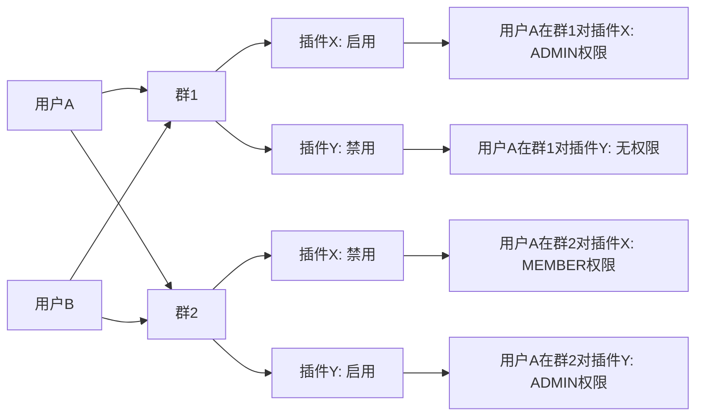
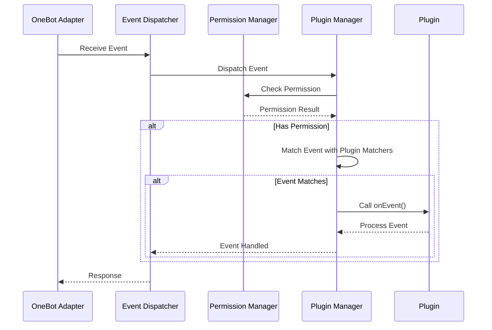

## 前言

我的 QQ 机器人已经写了两版了，但是感觉都总是不得劲。思来想去，应该是每次开写的时候都没有梳理好整体思路，打开 IDEA 就是干，不免写着写着就出现各种意料之外的情况。

于是今天晚上我找[千问](https://www.qianwen.com/)聊了一下这个话题，我们俩一起畅想了一番 QQ 机器人的设计

## 整体架构

在我给出的多次英明指导下，千问勤勤恳恳地为我输出了一套让我比较满意的架构。

在这个架构中提供了简单的权限模块、插件模块。这将会是我下一个机器人的蓝图（虽然最终发现这跟我上一个烂尾的机器人没啥区别就是了）



## 插件系统

插件系统是一个开放的框架必须支持的，尤其对于 qq bot 这样尤其需要活跃社区的产品。

千问建议我基于 Spring 提供的 @EventListener 机制扩展我的插件系统，这一机制天然适合 qq bot 这样事件驱动的系统。



## 项目结构

```
qq-bot/                              # 父项目（根目录）
├── pom.xml                         # 父POM，管理所有子模块
├── README.md
├── docs/
│   ├── architecture.md
│   └── plugin-development-guide.md
├── qq-bot-core/                    # 核心模块（接口定义、基础模型）
│   ├── pom.xml
│   └── src/main/java/com/example/qbot/core/
│       ├── api/
│       │   ├── Plugin.java                    # 插件基础接口
│       │   ├── CommandPlugin.java             # 命令插件接口
│       │   ├── EventPlugin.java               # 事件插件接口
│       │   └── MessageHandlerPlugin.java      # 消息处理器插件接口
│       ├── model/
│       │   ├── MessageEvent.java              # 消息事件基础模型
│       │   ├── GroupMessageEvent.java         # 群消息事件
│       │   ├── PrivateMessageEvent.java       # 私聊消息事件
│       │   └── PluginContext.java             # 插件上下文
│       ├── session/
│       │   └── MessageSession.java            # 消息会话对象
│       ├── cqcode/
│       │   └── CqCodeParser.java              # CQ码解析器
│       └── annotation/
│           └── PluginInfo.java                # 插件信息注解
├── qq-bot-domain/                  # 领域模型模块
│   ├── pom.xml
│   └── src/main/java/com/example/qbot/domain/
│       ├── entity/
│       │   └── PluginMetadata.java            # 插件元数据
│       ├── repository/
│       │   └── PluginRepository.java          # 插件仓库接口
│       └── service/
│           └── PluginService.java             # 插件服务接口
├── qq-bot-plugin-system/           # 插件系统核心模块
│   ├── pom.xml
│   └── src/main/java/com/example/qbot/plugin/
│       ├── PluginManager.java                 # 插件管理器
│       ├── PluginRegistry.java                # 插件注册器
│       ├── PluginClassLoader.java             # 插件类加载器
│       └── PluginLifecycleManager.java        # 插件生命周期管理
├── qq-bot-command-system/          # 指令系统模块
│   ├── pom.xml
│   └── src/main/java/com/example/qbot/command/
│       ├── CommandRegistry.java               # 命令注册器
│       ├── CommandMatcher.java                # 命令匹配器
│       ├── CommandProcessor.java              # 命令处理器
│       └── handler/
│           └── CommandHandler.java            # 命令处理器接口
├── qq-bot-adapter/                 # 适配器模块（协议通信）
│   ├── pom.xml
│   └── src/main/java/com/example/qbot/adapter/
│       ├── qq/
│       │   ├── QqProtocolAdapter.java        # QQ协议适配器（Go-CQHTTP/Mirai）
│       │   ├── QqMessageConverter.java       # QQ消息格式转换器
│       │   └── QqConnectionManager.java      # QQ连接管理器
│       └── websocket/
│           └── QqWebSocketHandler.java       # QQ WebSocket消息处理器
├── qq-bot-bot-engine/              # 机器人引擎模块
│   ├── pom.xml
│   └── src/main/java/com/example/qbot/engine/
│       ├── BotManager.java                    # 机器人管理器
│       ├── MessageProcessor.java              # 消息处理器
│       ├── RobotMessenger.java                # 机器人消息发送器
│       └── event/
│           └── EventPublisher.java            # 事件发布器
├── qq-bot-web-api/                 # Web API模块
│   ├── pom.xml
│   └── src/main/java/com/example/qbot/web/
│       ├── QqBotWebApplication.java          # Web应用启动类
│       ├── controller/
│       │   ├── PluginController.java         # 插件管理控制器
│       │   ├── CommandController.java        # 命令管理控制器
│       │   └── BotController.java            # 机器人管理控制器
│       └── config/
│           └── WebSocketConfig.java          # WebSocket配置
├── qq-bot-application/             # 主应用模块（可执行JAR）
│   ├── pom.xml
│   ├── src/main/java/com/example/qbot/app/
│   │   └── QqBotApplication.java             # 主应用启动类
│   └── src/main/resources/
│       ├── application.yml                   # 应用配置
│       ├── banner.txt                        # 启动横幅
│       └── plugins/                          # 插件存放目录
└── plugins/                        # 插件开发目录（独立项目）
    ├── time-plugin/
    │   ├── pom.xml
    │   └── src/main/java/com/example/plugins/time/
    │       ├── TimePlugin.java               # 时间插件主类
    │       └── handlers/
    │           ├── TimeCommandHandler.java   # 时间命令处理器
    │           └── DateCommandHandler.java   # 日期命令处理器
    └── weather-plugin/
        ├── pom.xml
        └── src/main/java/com/example/plugins/weather/
            ├── WeatherPlugin.java            # 天气插件主类
            └── handlers/
                └── WeatherCommandHandler.java # 天气命令处理器
```

### core 模块

提供基础的注解、异常、工具类和数据模型

被其他所有模块依赖

### domain 模块

数据库实体类、仓库接口、领域服务

### 插件系统模块

插件加载、管理、生命周期控制

### 指令系统

指令解析、匹配、执行

### 适配器模块

外部系统集成

### engine 模块

机器人核心逻辑，消息处理，事件分发

### web 模块

提供 web 接口

### application 模块

整合其他模块

## 图表







```
yuni-bot/
├── application.jar                 # 主程序
├── plugins/                       # 插件目录
│   ├── plugin1.jar
│   ├── plugin2.jar
│   └── development/
│       └── dev-plugin.class
├── config/
│   └── group-permissions.json     # 权限配置
└── logs/
```

public class PassivePluginInstance implements PluginInstance {

    ...
    private YuniEventDetector<?> detector;
    ...
}