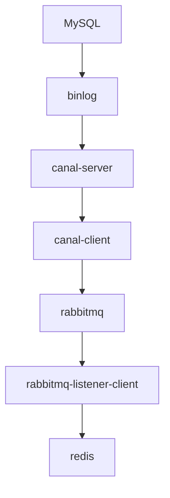

## 背景

为了提高服务性能，对于不重要的数据常常不直接查询数据库，而是将其同步到缓存中访问，加快查询速度。在网上检索查找方案后，发现一个比较[重量级](https://zh.moegirl.org.cn/%E4%B8%9C%E7%99%BE%E5%BE%80%E4%BA%8B#%E8%BF%99%E4%BD%8D%E6%9B%B4%E6%98%AF%E9%87%8D%E9%87%8F%E7%BA%A7)的方案，决定总结出来以作学习。

## 概述



* MySQL 开启 binlog ，记录条目变动

* canal 是阿里的一个开源项目，可以伪装成 MySQL 的一个 slave 实例，用于监听 MySQL 的 binlog 变动

* canal 监听到变动后，通过 canal-client 将变动推送到消息队列，这里选择了 rabbitmq

* 最后，订阅消息队列的客户端将产生变化的数据库条目同步到 redis

## MySQL

这个没什么好说的，直接用 docker 启动一个就行

```bash
docker run -d \
  --name "$MYSQL_CONTAINER_NAME" \  # 容器名称
  -p "$MYSQL_PORT":3306 \  # 将 3306 映射到宿主机端口
  -v "$MYSQL_DATA_DIR":/var/lib/mysql \  # 挂载数据卷
  -v "$MYSQL_CONF_DIR":/etc/mysql/conf.d \  # 挂载配置文件
  -e MYSQL_ROOT_PASSWORD="$MYSQL_ROOT_PASSWORD" \  # 设置 root 用户的密码
  -e TZ=Asia/Shanghai \  # 设置时区
  mysql:"$MYSQL_VERSION"  # 镜像版本
```

## canal-server

这步卡了我最久，阿里的文档写得跟 x 一样，docker 方案死活搞不定，最后没办法，起了个原生服务。

https://github.com/alibaba/canal/wiki/QuickStart <-- QuickStart 文档，参考这个文档启动的

## rabbitmq

这个也挺简单的

```bash
docker run -d \
  --name "$RABBIT_CONTAINER_NAME" \  # 容器名称
  -p "$RABBIT_PORT":5672 \  # 客户端连接端口
  -p "$RABBIT_MGT_PORT":15672 \  # 网页管理面板访问端口
  -e RABBITMQ_DEFAULT_USER="$RABBIT_USER" \  # 客户端访问用户名
  -e RABBITMQ_DEFAULT_PASS="$RABBIT_PASS" \  # 客户端访问密码
  -e RABBITMQ_SERVER_ADDITIONAL_ERL_ARGS="-rabbit loopback_users []" \  # 清空 loopback_users ，即允许所有用户远程访问
  rabbitmq:3-management  # 镜像版本
```

## redis

用 docker 启动也简单

```bash
docker run -d \
  --name $CONTAINER_NAME \
  -p $REDIS_PORT:$REDIS_PORT \  # 端口映射
  -v "$CONFIG_DIR:/usr/local/etc/redis" \  # 配置文件映射
  -v "$DATA_DIR:/data" \  # 数据卷映射
  redis redis-server /usr/local/etc/redis/redis.conf  # 配置文件加载
```

```conf
# Redis 配置文件
bind 0.0.0.0
port 6379
requirepass secure_passwd
appendonly yes
save 900 1
save 300 10
save 60 10000
dir /data
```

## canal-client

使用 SpringBoot 实现

### 引入依赖

```xml
<dependency>
    <groupId>com.xpand</groupId>
    <artifactId>starter-canal</artifactId>
    <version>0.0.1-SNAPSHOT</version>
</dependency>
<dependency>
    <groupId>org.springframework.boot</groupId>
    <artifactId>spring-boot-starter-amqp</artifactId>
</dependency>
```

### 配置文件

```yml
# 到 rabbitmq 的配置
spring:
  rabbitmq:
    host: <host>
    port: 5672
    username: guest
    password: guest
    virtual-host: /
    listener:
      simple:
        #消费者数量
        concurrency: 10
        max-concurrency: 10
        #消费者每次从队列获取的消息数量
        prefetch: 1
        #消费者自动启动
        auto-startup: true
        #消费失败，自动重新入队
        default-requeue-rejected: true
    #启用发送重试
    template:
      retry:
        enabled: true
        initial-interval: 1000
        max-attempts: 3
        max-interval: 10000
        multiplier: 1.0
# 到 canal 服务的配置
canal:
  client:
    instances:
      example:
        host: <host>  # canal 服务的 IP
        port: 11111
```

### 关键代码

在启动类上添加注解

```java
@SpringBootApplication
// @EnableCanalClient
@EnableCanalClient
public class CanalApp {
    public static void main(String[] args) {
        SpringApplication.run(CanalApp.class, args);
    }
}
```

监听 canal 服务并推送消息到 rabbitmq 的代码

```java

// 注入消息队列工具
@Autowired
MQSender sender;

/**
 * 监听example-table表
 * @param eventType
 * @param rowData
 */
// destination：监听的 canal 服务名;   schema: 库名;               table: 监听的表名           eventType: 增删改
@ListenPoint(destination = "example", schema = "example-schema", table = {"example-table"}, eventType = {CanalEntry.EventType.UPDATE, CanalEntry.EventType.INSERT, CanalEntry.EventType.DELETE})
public void onexample-tableUpdate(CanalEntry.EventType eventType, CanalEntry.RowData rowData) {
    if (eventType == CanalEntry.EventType.DELETE) {
        // 删除记录
        List<CanalEntry.Column> beforeColumnsList = rowData.getBeforeColumnsList();
        for (CanalEntry.Column column : beforeColumnsList) {
            //column.getName(列的名称   column.getValue() 列对应的值
            if (column.getName().equals("id")) {
                logger.info("delete id {}", column.getValue());
                sender.sendCanalMessage(new CanalMessage("example-table", "example-table", Long.parseLong(column.getValue()), OperationType.DELETE));
            }
        }
    } else {
        // 新增或者修改记录
        List<CanalEntry.Column> afterColumnsList = rowData.getAfterColumnsList();
        for (CanalEntry.Column column : afterColumnsList) {
            //column.getName(列的名称   column.getValue() 列对应的值
            if (column.getName().equals("id")) {
                logger.info("insert or update id {}", column.getValue());
                if (eventType == CanalEntry.EventType.INSERT) {
                    sender.sendCanalMessage(new CanalMessage("example-table", "example-table", Long.parseLong(column.getValue()), OperationType.ADD));
                }else {
                    sender.sendCanalMessage(new CanalMessage("example-table", "example-table", Long.parseLong(column.getValue()), OperationType.UPDATE));
                }
            }
        }
    }
}
```

## 消息队列监听服务

```xml
<!-- 消息队列依赖 -->
<dependency>
    <groupId>org.springframework.boot</groupId>
    <artifactId>spring-boot-starter-amqp</artifactId>
</dependency>
<!-- redis 依赖 -->
<dependency>
    <groupId>org.spr~ingframework.boot</groupId>
    <artifactId>spring-boot-starter-data-redis</artifactId>
</dependency>
```

```java
// 监听消息队列中的 CANAL_QUEUE 队列
@RabbitListener(queues=MQConfig.CANAL_QUEUE)
public void receiveCanalMsg(String message) {
    logger.info("receive message:" + message);
    CanalMessage canalMessage = BeanUtil.stringToBean(message, CanalMessage.class);
    if (canalMessage.getOperationType() == OperationType.DELETE) {
        // 删除操作
    } else {
        // 增加 / 更新操作
    }
}
```